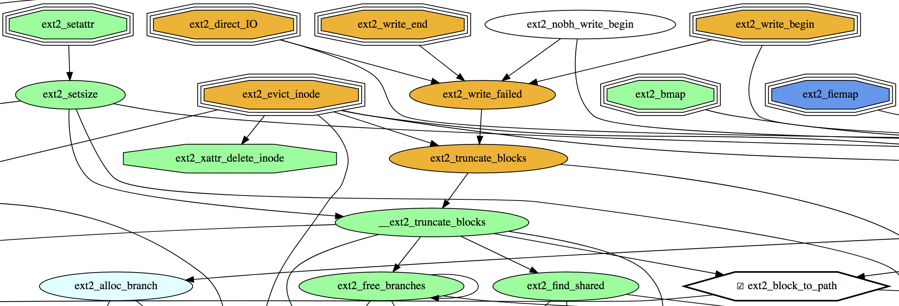

# Tools for style-preserving C-code transformations
[](https://travis-ci.org/evdenis/spec-utils)
[](https://coveralls.io/github/evdenis/spec-utils?branch=devel)

---


A Russian version of this page is available at [doc/README_ru.md](doc/README_ru.md)

The repository contains a number of tools for analyzing Linux kernel code.
The tools depend on external Perl modules.
To install the tools, run the following commands:
<pre>
$ cpan cpanm
$ cpanm --with-all-features --installdeps .
</pre>

Other external dependencies are described on the page [doc/EXTERNAL_DEPS.md](doc/EXTERNAL_DEPS.md)

All tools share the same cli options for specifying the kernel directory and a particular kernel module.
For convenience it is possible to set these directories as environment variables:
* **CURRENT_PROJECT** - directory of a Linux kernel module of interest
* **CURRENT_KERNEL**  - directory of Linux kernel code

# Short description of the tools

Each tool has its own man documentation available by the --help argument.
Here is a brief overview of the tools, their functionality, and purpose.

## Source code transformation

These two programs are used mainly to write ACSL specifications for kernel code.

* **extricate** - extracts all dependencies from the source code for
particular functions in a way that a compiler can build an object file after.
For verification tools (e.g., Frama-C) it's difficult to work with
large codebases (e.g., > 100000 sloc), which results in a significant
slowdown of their work. The "extricate" tool allows one to reduce
source code size by extracting only relevant parts of it.
In a resulting code, functions are ordered in accordance
with their callgraph.
[](https://asciinema.org/a/186080)
* **merge** - semi-automatically moves ACSL specifications from one
codebase to another without relying on a particular source structure.
In case of a conflict, it calls an external diff tool, e.g., meld, kdiff3.
The location of the functions in the files does not matter.
[](https://asciinema.org/a/186083)

## Gathering information from sources

These tools are designed to examine the source code of a kernel module
of interest, to inspect an interaction between a module and the kernel.
Used for exploring new source code releases and for reporting and
verification planning.

* **graph** - creates a source code map. A map is a callgraph of module functions.
* **graph_diff** - creates a map of callgraphs differences between two source code releases.
* **complexity_plan** - creates a report of functions metrics reflecting their complexity.
* **headers** - creates an "inclusion" map for header files.
* **calls** - the tool for analyzing and collecting statistics of functions and macros calls in a kernel module.
* **lsm_diff** - the tool for analyzing the LSM interface of the kernel and its use in a kernel module.
* **stapgen** - based on the source codes creates a script for SystemTap. The script dynamically intercepts the LSM interface calls, logs the arguments and a context of a function call. Allows one to keep track of what actions in the OS lead to calls of specific LSM functions.
* **get_preprocessed** - performs partial (only kernel macros are inlined) or full preprocessing of a kernel module source code.
* **recursion** - the tool for detecting a direct and an indirect recursion in a kernel module source code.
* **count_specifications** - counts number of lines of ACSL specifications in sources.
* **list_functions** - outputs a "flat" list of a module functions in accordance with verification priorities.

Formats of configuration files for these tools are described in a separate file [doc/FORMAT.md](doc/FORMAT.md)

# Interactive callgraph map

## Callgraph example for the fs/ext2 module

This example uses Docker deployment. The callgraph map is available at localhost via port forwarding.
```bash
docker build -t ext2_callgraph .
docker run -d -p 127.0.0.1:8889:80 ext2_callgraph
firefox http://localhost:8889/graph
```

[](https://www.youtube.com/watch?v=AuUsaleib9M)

## Address

* only image: [http://localhost:8889/graph/image](http://localhost:8889/graph/image)
* html: [http://localhost:8889/graph](http://localhost:8889/graph)

To move across the map, move the mouse pointer to the borders.
To change the scale, use the mouse wheel.

## GET parameters

* fmt=fmt - image format (svg|png|jpeg)
* func=func1,func2,... - functions separated by commas (display not the whole callgraph, but only for the specified functions)
* level=n - display a map for functions with verification priority n
* no-display-done=(0|1) - don't display verified functions (default - 0)
* from-done=(0|1) - display a callgraph starting from verified functions (default - 0)
* reverse=(0|1) - display a callgraph (caller->callee) in the reversed order (callee->caller) (default - 0)
* available=(0|1) - display functions available for verification, based on a set of currently verified functions (default - 0)
* legend=(0|1) - display priority list on the map (default - 1)

Example: [http://localhost:8889/graph/image?fmt=png&func=ext2_setattr,ext2_mknod](http://localhost:8889/graph/image?fmt=png&func=ext2_setattr,ext2_mknod)

A callgraph map is generated for each request. If priority settings,
the set of verified functions, or code is changed, it will be displayed on the
next request (for example, page reload). The default format is svg.
If you click on a node, the page will be reloaded with the request
http://localhost:8889/graph/image?func={node_name}

# How to Contribute

* Remove all experimental constructions
* Get rid of smart-matching
* Minimize use of lib/Local functions, replace them with functions from other libraries (List::Utils, List::MoreUtils)
* Add tests for other tools (for example, comparison of dot files generated by graph)
* Use Dist::Zilla or another system and upload the source code to CPAN
* Add `--help` to describe tool parameters where needed
* Simplify the customization of regular expressions from `*Set.p` modules (add the ability to configure them based on the selection of standard constructions and macro use patterns)
* ...
